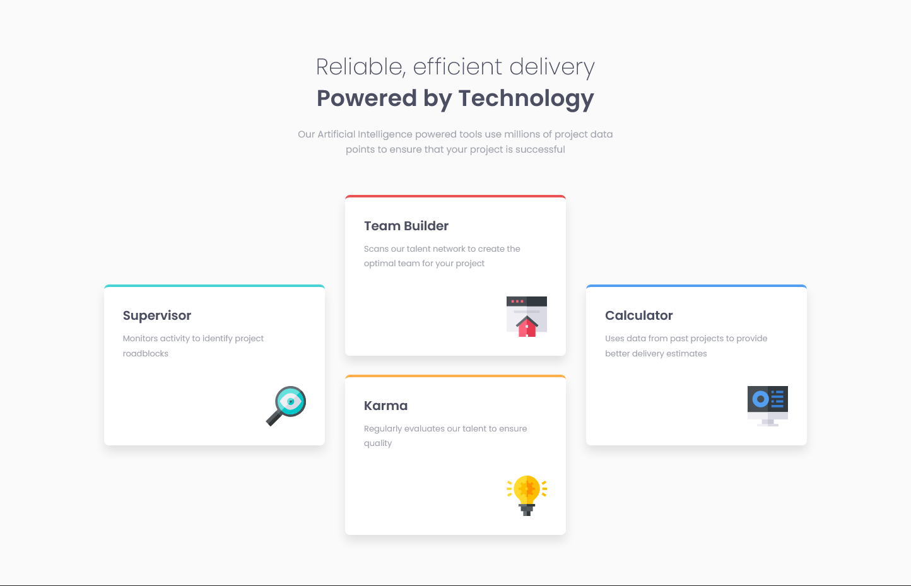
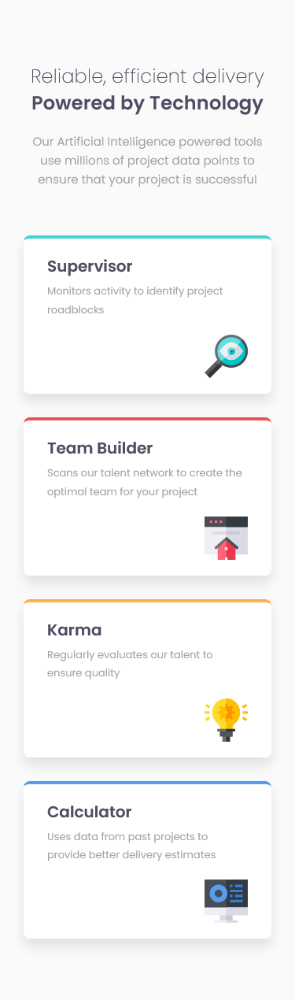

# Frontend Mentor - Four card feature section solution

This is a solution to the [Four card feature section challenge on Frontend Mentor](https://www.frontendmentor.io/challenges/four-card-feature-section-weK1eFYK). Frontend Mentor challenges help you improve your coding skills by building realistic projects.

## Table of contents

- [The challenge](#the-challenge)
- [Screenshot](#screenshot)
- [Links](#links)
- [Author](#author)

### The challenge

Users should be able to:

- View the optimal layout for the site depending on their device's screen size

### Screenshot

### Links

- Solution URL: [solution URL](https://github.com/Giulo25/Four-card-feature-section)
- Live Site URL: [live site URL](https://giulo25.github.io/Four-card-feature-section/)

## Author

- Website - [Simone Giulivi](https://www.simonegiulivi.com)
- Frontend Mentor - [@giulo25](https://www.frontendmentor.io/profile/giulo25)
